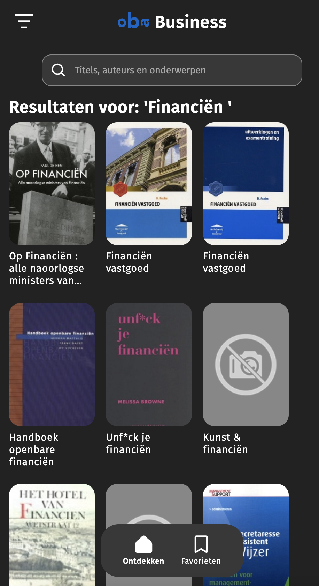

# 

## Table of contents
  - [Table of contents](#table-of-contents)
  - [About](#about)
  - [Features](#features)
  - [API documentation](#API-documentation)
  - [Installing](#installing)
  - [Author](#author)
  - [Contributing](#contributing)
  - [License](#license)

## [Live demo](https://jornveltrop.github.io/OBA-Business/)


## About
**OBA Business is een web applicatie waarmee ondernemers in de OBA catalogus kunnen zoeken en ontdekken gericht op ondernemen. Ook kunnen de items worden opgeslagen, zodat deze later nog een keer bekeken kunnen worden. Je kunt de items ook gemakkelijk reserveren in de app.**

Deze web app maakt gebruik van de OBA API. Deze haalt op basis van een zoekopdracht items op uit hun database. 



## Features
|                                                                   |     |
| ----------------------------------------------------------------- | --- |
| 🔍  Zoek ondernemings gerichte items uit de OBA collectie!        | ✔   |
| 🧐  Lees informatie over de items.                                | ✔   |
| ⭐  Sla jouw favoriete items op.                                  | ✔   |


## API documentation
Voor deze web app heb ik gebruik gemaakt van de OBA API. De documentatie van deze API is hier te vinden: [OBA API](https://zoeken.oba.nl/api/v1/)

## Installing
Clone deze repository naar jouw lokale folder
```
git clone https://github.com/jornveltrop/OBA-Business.git
```
<br>

Stel jouw API key in via de [OBA API](https://zoeken.oba.nl/api/v1/)

## Author
De maker van deze app is: [*Jorn Veltrop*](https://github.com/jornveltrop)


## Contributing
Als je wilt bijdragen aan deze app kun je dat doen door middel van een [Issue](https://github.com/jornveltrop/OBA-Business/issues).

## License
Dit project valt onder de MIT [license](https://github.com/jornveltrop/OBA-Business/blob/main/LICENSE).
